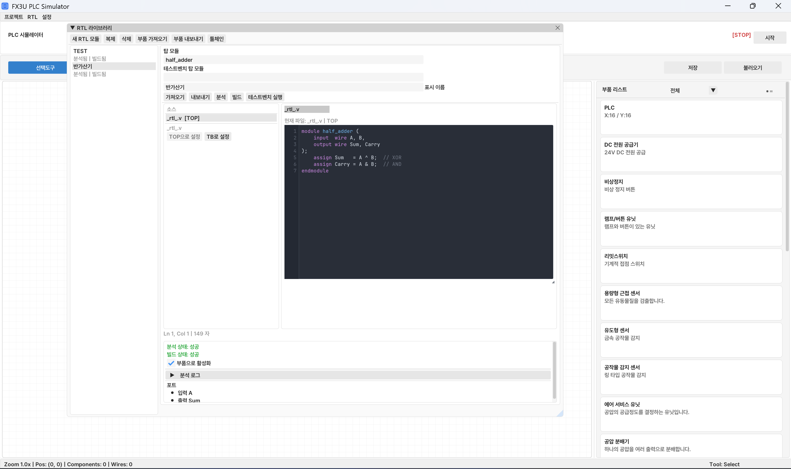

# PLC_Simulator
[](https://isocpp.org/)
[](https://cmake.org/)
[](https://www.gnu.org/licenses/gpl-3.0)
[]()


Real-time PLC wiring/programming simulator with integrated physics, OpenPLC-compatible ladder execution, and RTL hardware design workflow.

Read in [한국어](README_kr.md), [日本語](README_ja.md)

[Project History](docs/Project_History_en.md) · [1.1.0 Patch Notes](PATCH_NOTES_1.1.0.md)

## Why this project?

PLC training is often constrained by hardware accessibility, time, and cost.  
This project aims to:

- provide wiring + programming + simulation in one environment
- offer a workflow close to real PLC learning
- enable fast iterative practice on a desktop simulator
- bridge PLC logic and RTL hardware design in a single tool

## It focuses on

- practical workflow: build wiring, write ladder logic, verify behavior, and design RTL modules in one place
- extensibility: modular architecture across components/physics/programming/RTL
- performance: LOD, viewport culling, spatial partitioning, and bounded resource caching
- realism: OpenPLC-based conversion/execution path with Box2D integration

## Features

### Wiring mode

- interactive canvas with drag-and-drop component placement
- automatic wire routing and connection management
- smart tag labels with overlap avoidance and multi-arrow merging
- component library including PLC I/O, pneumatic (FRL, cylinder, solenoid valve, meter valve), switches, sensors, relays, and more
- sink/source wiring mode conversion
- gesture and touch support: pinch zoom, two-finger pan, rotational knob control for FRL/meter valve

### Ladder programming mode

- GX Developer–style ladder editor
- instruction support: `XIC`, `XIO`, `OTE`, `SET`, `RST`, `TON`, `CTU`, `RST_TMR_CTR`, `BKRST`
- block selection, copy/paste, and drag-based rung reordering
- vertical branch (OR) editing with `F9` / `Shift+F9`
- OpenPLC-compatible LD conversion and compilation pipeline
- GX2 CSV save/load for ladder programs

### Monitor mode

- real-time I/O, timer, and counter state inspection
- live current-value and preset display synced with the active compiled ladder

### RTL mode *(new in 1.1.0)*


- integrated Verilog RTL editor with syntax highlighting
- RTL module management: create, rename, delete, and organize modules in the RTL library
- analyze, build, and testbench workflows with dedicated log panels
- RTL toolchain management: one-click setup, verification, and removal of Icarus Verilog / GTKWave
- `.plccomp` component packages: export/import reusable RTL modules with optional Verilog source or runtime-only bundles
- RTL runtime artifacts are bundled inside `.plcproj` project packages for cross-machine portability

### Simulation engine

- PLC design based on Mitsubishi FX3U-32M
- custom in-house multi-domain physics engine (electrical / pneumatic / mechanical)
- Box2D integration for collisions and workpiece interaction
- component input resolver for limit switch, button unit, and emergency stop state merging

### Project workflow

- unified project package format (`.plcproj`) carrying wiring, ladder, and RTL data
- `Ctrl+S` quick save in both wiring and programming modes
- NSIS installer with optional RTL toolchain cleanup on uninstall
- backward-compatible with 1.0.x project files

### Localization and help

- multi-language UI: Korean, English, Japanese (`resources/lang`)
- built-in help covering wiring, programming, RTL, shortcuts, and camera controls

## Prerequisites

- CPU: 4 threads or more
- RAM: 2 GB minimum
- CMake >= 3.20
- C++20 compiler
- OpenGL runtime
- Git (for FetchContent dependency download)
- *(optional)* PowerShell 7+ for RTL toolchain scripts on older Windows versions

## Third-party libraries

- GLFW
- GLAD
- Dear ImGui
- nlohmann/json
- miniz
- Box2D
- NanoSVG

## Tech Stack

| Area | Stack |
|---|---|
| Language | C++20 |
| Build | CMake, CPack (NSIS + ZIP) |
| Rendering/UI | OpenGL, GLFW, GLAD, Dear ImGui |
| Physics | Custom in-house multi-domain physics engine (electrical/pneumatic/mechanical) + Box2D |
| PLC/Ladder | OpenPLC-compatible LD conversion and execution pipeline |
| RTL | Icarus Verilog, GTKWave (external toolchain, managed from the app) |
| Data/IO | nlohmann/json, miniz, XML serializer |

This project uses a custom in-house simulation engine as its core, not a general-purpose external game engine.

## Build

```bash
cmake -S . -B build -DCMAKE_BUILD_TYPE=Release
cmake --build build --config Release
```

## Run

```bash
# single-config generator
./build/bin/PLCSimulator

# multi-config (Visual Studio)
./build/bin/Release/PLCSimulator.exe
```

## Tests

```bash
cmake -S . -B build-test -DBUILD_TESTING=ON
cmake --build build-test --target plc_tests
ctest --test-dir build-test --output-on-failure
```

## Project structure

```text
include/plc_emulator/   # public headers
src/                    # active implementation
  application/          # app lifecycle, input, rendering, RTL UI
  programming/          # ladder editor, compiler, PLC executor
  wiring/               # wiring canvas, components, physics sync
  rtl/                  # RTL project/library/runtime management
  project/              # project file save/load, GX2 CSV
resources/              # fonts, i18n lang files, assets
tools/                  # RTL toolchain setup/verify/delete scripts
tests/                  # unit/integration tests
legacy/                 # old MVP code (reference only, not built)
```

## Keyboard shortcuts

| Shortcut | Action |
|---|---|
| `F2` | Toggle monitor mode |
| `F5` / `F6` / `F7` | XIC / XIO / Coil |
| `F9` | Add vertical line |
| `Shift+F9` | Remove vertical line |
| `Ctrl+Z` / `Ctrl+Y` | Undo / Redo |
| `Ctrl+S` | Save project |
| `Ctrl+C` / `Ctrl+V` | Copy / Paste selection |
| `Delete` | Delete selected rung block |

Canvas navigation: mouse wheel zoom, middle-drag pan, `Alt`+right-drag pan, trackpad pinch/scroll, touch pinch zoom and drag pan.

(All shortcut strings are defined in `resources/lang/*.lang`.)

## Status

We're accepting pull requests for additional components and other bug fixes. Development is progressing incrementally.

## License

GPL-3.0
