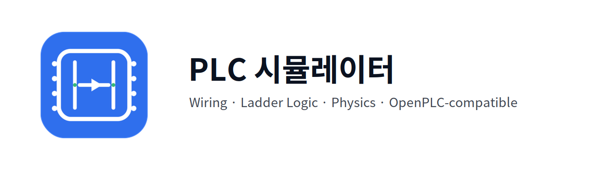

# PLC_Simulator
[](https://isocpp.org/)
[](https://cmake.org/)
[](https://www.gnu.org/licenses/gpl-3.0)
[]()


통합 물리 시뮬레이션과 OpenPLC 호환 레더 실행 경로를 포함한 실시간 PLC 배선/프로그래밍 시뮬레이터입니다.

[English](README.md), [日本語](README_ja.md)로 보기

[프로젝트 개발 보고서는 여기에](docs/Project_History.md)

## 이 프로젝트를 만든 이유

PLC 실습은 장비 접근성, 시간, 비용 제약이 큰 편입니다.  
이 프로젝트의 목표는 다음과 같습니다.

- 배선 + 프로그래밍 + 시뮬레이션을 하나의 환경에서 제공
- 실제 PLC 학습 흐름에 가까운 작업 경험 제공
- 데스크톱에서 빠른 반복 실습 지원

## 핵심 방향

- 실용 워크플로우: 배선 구성, 레더 작성, 동작 검증을 한 곳에서 처리
- 확장성: component/physics/programming 모듈 분리 구조
- 성능: LOD, 뷰포트 컬링, 공간 분할 기반 최적화
- 현실성: OpenPLC 기반 변환/실행 경로 + Box2D 연동

## 주요 기능

- Wiring 모드
- Ladder Programming 모드
- Monitor 모드 (I/O, 타이머, 카운터 확인)
- PLC 디자인은 Mitsubishi FX3U-32M 기반
- 명령어 지원: `XIC`, `XIO`, `OTE`, `SET`, `RST`, `TON`, `CTU`, `RST_TMR_CTR`, `BKRST`
- OpenPLC 호환 LD 변환/컴파일 파이프라인
- 물리 시뮬레이션 (전기 / 공압 / 기계 + 워크피스 상호작용)
- 충돌/상호작용을 위한 Box2D 통합
- 다국어 리소스 (`resources/lang`: ko/en/ja)
- 프로젝트 저장/불러오기

## 요구 사항

- CPU: 4스레드 이상
- RAM: 최소 2GB
- CMake >= 3.20
- C++20 컴파일러
- OpenGL 런타임
- Git (FetchContent 의존성 다운로드용)

## 서드파티 라이브러리

- GLFW
- GLAD
- Dear ImGui
- nlohmann/json
- miniz
- Box2D
- NanoSVG

## 기술 스택

| 영역 | 스택 |
|---|---|
| 언어 | C++20 |
| 빌드 | CMake |
| 렌더링/UI | OpenGL, GLFW, GLAD, Dear ImGui |
| 물리 | 자체(in-house) 멀티 도메인 물리 엔진(전기/공압/기계) + Box2D |
| PLC/레더 | OpenPLC 호환 LD 변환/실행 파이프라인 |
| 데이터/입출력 | nlohmann/json, miniz, XML serializer |

이 프로젝트는 범용 외부 게임 엔진이 아니라, 자체 시뮬레이션 엔진을 코어로 사용합니다.

## 빌드

```bash
cmake -S . -B build -DCMAKE_BUILD_TYPE=Release
cmake --build build --config Release
```

## 실행

```bash
# single-config generator
./build/bin/PLCSimulator

# multi-config (Visual Studio)
./build/bin/Release/PLCSimulator.exe
```

## 테스트

```bash
cmake -S . -B build-test -DBUILD_TESTING=ON
cmake --build build-test --target plc_tests
ctest --test-dir build-test --output-on-failure
```

## 프로젝트 구조

```text
include/plc_emulator/   # 공개 헤더
src/                    # 현재 사용 중인 구현 코드
resources/              # 폰트, i18n, 에셋
tests/                  # 단위/통합 테스트
legacy/                 # 구 MVP 코드 (참조 전용, 빌드 제외)
```

## 사용 참고

- `F2`: 모니터 모드
- `F5/F6/F7`: XIC/XIO/Coil
- `F9`, `Shift+F9`: 세로 라인 추가/삭제
- `Ctrl+Z`, `Ctrl+Y`: 실행 취소/다시 실행

(단축키 문자열은 `resources/lang/*.lang`에 정의되어 있습니다.)

## 상태

부품추가와 기타 버그수정의 대한 pull request를 받고 있습니다.
개발은 점진적으로 진행되고 있습니다.

## 라이선스

GPL-3.0
